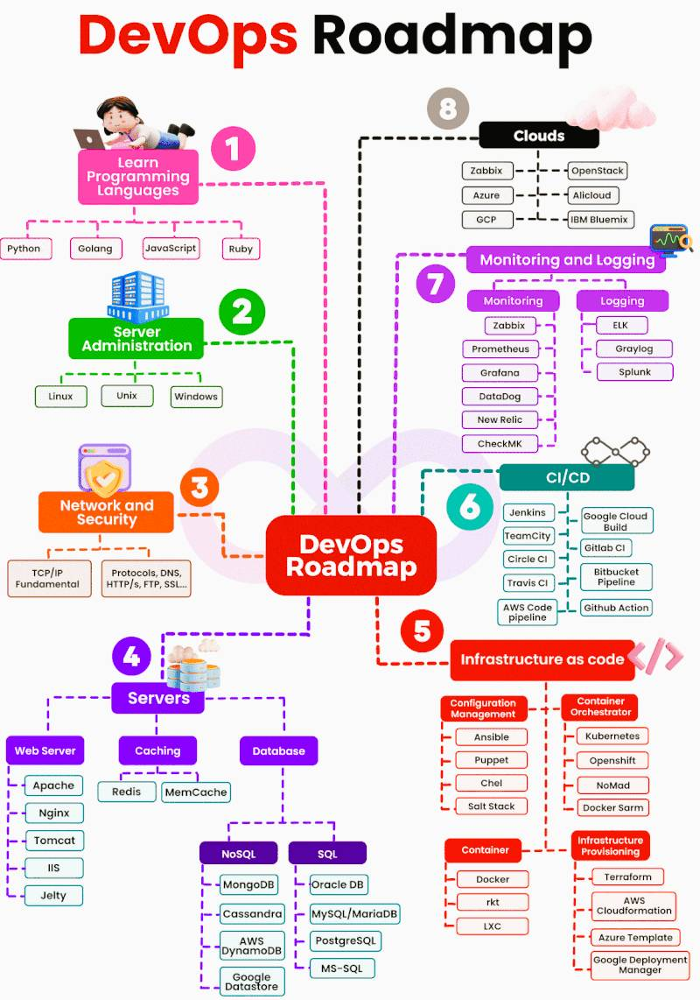

### DevOps
DevOps یک فرهنگ و مجموعه‌ای از روش‌ها است که برای بهبود همکاری و ارتباط بین تیم‌های توسعه‌دهندگان (Development) و تیم‌های عملیات (Operations) طراحی شده است. هدف اصلی DevOps تسریع در فرآیند توسعه نرم‌افزار و کاهش فاصله بین نوشتن کد و پیاده‌سازی آن در محیط تولید است. این فرهنگ با استفاده از ابزارها و خودکارسازی فرآیندها، به تیم‌ها این امکان را می‌دهد که به‌طور مداوم نرم‌افزارها را تست، به‌روزرسانی، و مستقر کنند. DevOps بر اصول همکاری، بازخورد مداوم، و تحویل مداوم (CI/CD) تأکید دارد و به تیم‌ها کمک می‌کند تا نرم‌افزار را سریع‌تر و با کیفیت بالاتر ارائه دهند.

### Site Reliability Engineering (SRE)
Site Reliability Engineering (SRE) یک رشته مهندسی است که بر روی بهبود قابلیت اطمینان، عملکرد و مقیاس‌پذیری سیستم‌های نرم‌افزاری در مقیاس‌های بزرگ تمرکز دارد. این حوزه با ترکیب اصول مهندسی نرم‌افزار و عملیات، تلاش می‌کند تا سیستم‌های پیچیده را به‌طور مداوم قابل اعتماد، کارآمد و مقیاس‌پذیر نگه دارد. SRE به‌طور خاص بر روی بهبود دسترسی، کاهش زمان‌های خرابی، و مدیریت ترافیک در سیستم‌های توزیع‌شده تمرکز دارد و از شاخص‌های کلیدی مانند Service Level Objectives (SLO) و Service Level Indicators (SLI) برای ارزیابی و بهبود عملکرد سیستم‌ها استفاده می‌کند. علاوه بر این، SRE از خودکارسازی، نظارت دقیق، و فرآیندهای خطایابی برای جلوگیری از بروز مشکلات و کاهش زمان‌های خرابی استفاده می‌کند، به طوری که تیم‌های توسعه بتوانند بیشتر بر روی ویژگی‌های جدید و توسعه محصولات تمرکز کنند.

### تفاوت DevOps با SRE
تفاوت DevOps با SRE در این است که Site Reliability Engineering (SRE) بیشتر بر حفظ و بهبود قابلیت اطمینان سیستم‌های تولید تمرکز دارد. در حالی که DevOps به‌طور کلی به یکپارچه‌سازی توسعه و عملیات می‌پردازد و بر خودکارسازی، سرعت و بهره‌وری تاکید دارد، SRE با استفاده از اصول مهندسی نرم‌افزار و روش‌های دقیق‌تر، به‌ویژه در مورد نظارت و نگهداری سیستم‌های مقیاس‌پذیر، به تضمین عملکرد، در دسترس بودن و قابلیت اطمینان سیستم‌ها می‌پردازد. در واقع، SRE به‌عنوان یک تخصص در داخل DevOps دیده می‌شود که بیشتر بر روی عملکرد و پایداری سیستم‌های عملیاتی تمرکز دارد.

---

### CI/CD
CI/CD مخفف Continuous Integration (ادغام مداوم) و Continuous Delivery/Continuous Deployment (تحویل/انتشار مداوم) است و یک مجموعه از فرآیندها و بهترین شیوه‌ها است که به تیم‌های نرم‌افزاری کمک می‌کند تا کد را به‌صورت مداوم و خودکار در محیط‌های مختلف تست، ساخته، و مستقر کنند. Continuous Integration (CI) به معنای ادغام مداوم تغییرات کد از تیم‌های مختلف در یک مخزن مشترک است، به‌طوری که تغییرات به‌طور روزانه یا حتی ساعتی تست و بررسی می‌شوند. این فرآیند باعث کاهش بروز خطاهای کد و مشکلات مربوط به هماهنگی در تیم‌های بزرگ می‌شود. در کنار آن، Continuous Delivery (CD) به این معناست که پس از ساخت و تست موفقیت‌آمیز، نرم‌افزار به‌طور خودکار آماده انتشار به محیط تولید می‌شود، در حالی که Continuous Deployment (CD) به معنای انتشار خودکار تغییرات به محیط تولید است، بدون نیاز به مداخله دستی. CI/CD به‌طور کلی باعث تسریع در فرآیند توسعه، بهبود کیفیت نرم‌افزار و افزایش سرعت تحویل می‌شود.

### GitOps
GitOps یک روش مدرن برای مدیریت زیرساخت‌ها و عملیات در سیستم‌های توزیع‌شده است که بر اساس اصول Git و خودکارسازی ساخته شده است. در این روش، تمام تغییرات و تنظیمات مربوط به زیرساخت، کدهای برنامه‌نویسی و پیکربندی‌ها در مخزن‌های Git ذخیره می‌شوند و از آنجا به‌طور خودکار به محیط‌های تولید یا تست اعمال می‌شوند. این به معنای استفاده از Git به عنوان منبع حقیقت (Source of Truth) برای تمامی تغییرات در سیستم است. با استفاده از GitOps، فرآیندهای استقرار، بروزرسانی و پیکربندی به‌طور کامل خودکار می‌شوند و هر تغییری در سیستم باید ابتدا از طریق درخواست‌های تغییر (Pull Requests) در Git انجام شود. GitOps امکان نظارت دقیق‌تر، بازگشت آسان به وضعیت‌های قبلی، و کاهش خطاهای انسانی را فراهم می‌کند و با استفاده از ابزارهایی مانند ArgoCD و Flux برای هماهنگی و اجرای تغییرات به‌صورت خودکار در کلاسترهای Kubernetes یا دیگر سیستم‌های توزیع‌شده، فرآیندهای DevOps را بهبود می‌بخشد.

### تفاوت CI/CD با GitOps
CI/CD و GitOps دو رویکرد متفاوت در فرآیندهای توسعه نرم‌افزار و مدیریت زیرساخت هستند. CI/CD (ادغام مداوم و تحویل مداوم) بر روی خودکارسازی فرآیندهای ساخت، تست و استقرار نرم‌افزار تمرکز دارد، به طوری که کد جدید به‌طور مداوم به مخزن گیت ادغام شده و پس از گذراندن مراحل تست به محیط‌های تولید یا تست ارسال می‌شود. در مقابل، GitOps رویکردی برای مدیریت زیرساخت‌ها است که در آن تنظیمات زیرساخت و پیکربندی‌ها به صورت declarative در Git ذخیره می‌شوند و هر تغییر از طریق Git به طور خودکار به محیط‌های مختلف اعمال می‌شود. به عبارت دیگر، GitOps از Git به‌عنوان منبع حقیقت برای زیرساخت‌ها استفاده می‌کند و تغییرات را از طریق ابزارهایی مانند ArgoCD یا Flux به محیط‌ها اعمال می‌کند. در حالی که CI/CD بیشتر بر فرآیندهای توسعه نرم‌افزار تمرکز دارد، GitOps بیشتر برای مدیریت و استقرار زیرساخت‌ها با استفاده از Git و خودکارسازی است.

---

### Docker
Docker یک پلتفرم متن‌باز است که به توسعه‌دهندگان و تیم‌های فناوری اطلاعات این امکان را می‌دهد که برنامه‌ها را در کانتینرهای مستقل و مقیاس‌پذیر بسته‌بندی کنند و آن‌ها را به راحتی در هر محیطی اجرا کنند. کانتینرها به‌طور خاص منابع سیستم را به‌طور بهینه مدیریت کرده و همه وابستگی‌های لازم برای اجرای یک برنامه را در خود دارند، بنابراین این برنامه‌ها می‌توانند به‌راحتی از محیط‌های توسعه به محیط‌های تولید منتقل شوند. Docker به توسعه‌دهندگان کمک می‌کند که فرآیندهای ساخت، تست، و استقرار را خودکار کرده و محیط‌های یکسانی را در تمامی مراحل چرخه حیات نرم‌افزار فراهم کنند. این فناوری در مقیاس‌پذیری، کاهش پیچیدگی‌ها و تسریع در روند توسعه بسیار مؤثر است و در بسیاری از پروژه‌های مدرن، به‌ویژه در استفاده از Kubernetes برای ارکستراسیون کانتینرها، کاربرد فراوان دارد.

### Docker Compose
Docker Compose یک ابزار متن‌باز است که به شما امکان می‌دهد چندین کانتینر Docker را به‌طور همزمان و به‌صورت هماهنگ مدیریت کنید. این ابزار با استفاده از یک فایل YAML به نام docker-compose.yml، تنظیمات کانتینرهای مختلف را تعریف کرده و آن‌ها را به‌طور خودکار راه‌اندازی می‌کند. Docker Compose برای پروژه‌های پیچیده که به چندین سرویس مختلف نیاز دارند، مانند یک اپلیکیشن وب که نیاز به پایگاه‌داده، کش، و سرویس‌های مختلف دارد، بسیار مفید است. به جای اجرای هر کانتینر به‌طور دستی، Docker Compose به شما این امکان را می‌دهد که تمام سرویس‌ها را با یک دستور ساده (docker-compose up) شروع، متوقف و مدیریت کنید. این ابزار به‌ویژه در فرآیند توسعه، تست و استقرار اپلیکیشن‌های مبتنی بر میکروسرویس‌ها یا چندین سرویس مختلف کاربرد دارد و فرایندهای خودکارسازی را تسهیل می‌کند.

### Dockerize
Dockerize به فرآیند تبدیل یک اپلیکیشن یا سرویس به یک کانتینر Docker گفته می‌شود، به‌طوری که اپلیکیشن می‌تواند به‌راحتی در هر محیطی اجرا شود، بدون توجه به پیکربندی یا وابستگی‌های سیستم عامل میزبان. این فرآیند شامل ایجاد یک فایل Dockerfile است که تمامی مراحل مورد نیاز برای ساخت کانتینر، از جمله نصب وابستگی‌ها، پیکربندی محیط و کپی کردن کدهای اپلیکیشن به داخل کانتینر را تعریف می‌کند. با Dockerize کردن اپلیکیشن‌ها، توسعه‌دهندگان می‌توانند محیط‌های پایدار و قابل پیش‌بینی برای اجرا و تست ایجاد کنند و از مشکلات مرتبط با تفاوت‌های سیستم‌عاملی جلوگیری کنند. این فرآیند در پروژه‌های مختلف، به‌ویژه در پروژه‌های چندسرویس و میکروسرویس‌ها، بسیار مهم است زیرا باعث تسهیل در استقرار، مقیاس‌پذیری و حمل‌پذیری اپلیکیشن‌ها می‌شود.

---

### راهنماهای مورد نیاز برای مهندسین دواپس

* [Agile](/cheatsheet/agile.md)
* [Scrum](/cheatsheet/scrum.md)
* [Git](/cheatsheet/git.md)
* [Docker](/cheatsheet/docker.md)
* [Docker Compose](/cheatsheet/docker-compose.md)
* [Dockerfile](/cheatsheet/dockerfile.md)
* [Bash](/cheatsheet/bash.md)
* [Yaml](/cheatsheet/yaml.md)
* [Marrkdown](/cheatsheet/marrkdown.md)

---

### نقشه راه یادگیری DevOps

