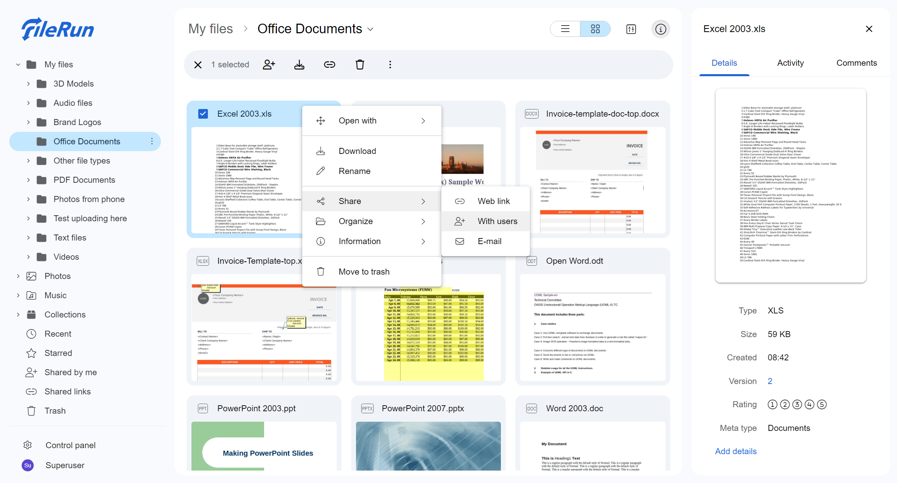

# FileRun

**FileRun** یک نرم‌افزار مدیریت فایل مبتنی بر وب است که به شما امکان می‌دهد فایل‌های خود را به‌راحتی ذخیره، سازماندهی و به اشتراک بگذارید. این سیستم قابلیت‌های پیشرفته‌ای برای بارگذاری، جستجو، مشاهده و ویرایش فایل‌ها را فراهم می‌کند و از پروتکل‌های مختلف مانند FTP و WebDAV برای مدیریت فایل‌ها پشتیبانی می‌کند. همچنین FileRun از ویژگی‌هایی همچون اشتراک‌گذاری فایل‌ها، ذخیره‌سازی امن، کنترل دسترسی، و پشتیبانی از فرمت‌های مختلف فایل برخوردار است. این ابزار برای افرادی که نیاز به یک پلتفرم مدیریت فایل ساده و قدرتمند دارند، بسیار مناسب است.

## اسکرین شات

در زیر یک تصویر از رابط کاربری FileRun آورده شده است:



### جهت اجرای FileRun با استفاده از Docker Compose، دستور زیر را وارد کنید:

```bash
sudo docker compose up -d
```


