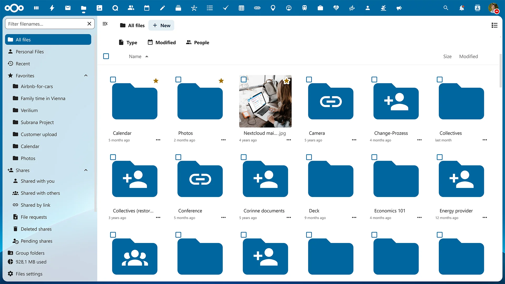

# Nextcloud with Nextcloud Office

**Nextcloud** یک پلتفرم ابری قدرتمند و متن‌باز است که به شما این امکان را می‌دهد تا به راحتی فایل‌ها، تماس‌ها، تقویم‌ها، مخاطبین و داده‌های دیگر خود را مدیریت کنید و به اشتراک بگذارید. این سرویس به‌ویژه برای تیم‌ها و سازمان‌ها مناسب است، چرا که امکان همکاری و ویرایش مستندات به‌صورت آنلاین، ذخیره‌سازی ایمن، و همگام‌سازی داده‌ها بین دستگاه‌های مختلف را فراهم می‌کند. با قابلیت نصب افزونه‌های مختلف و توانایی یکپارچه‌سازی با سایر ابزارهای کسب‌وکار، **Nextcloud** به شما این امکان را می‌دهد که پلتفرم ابری خود را به‌طور کامل کنترل کرده و از آن در جهت بهبود بهره‌وری استفاده کنید.

## اسکرین شات

در زیر یک تصویر از رابط کاربری Nextcloud آورده شده است:



### جهت اجرای Nextcloud با استفاده از Docker Compose، دستور زیر را وارد کنید:

```bash
sudo docker compose up -d
```


