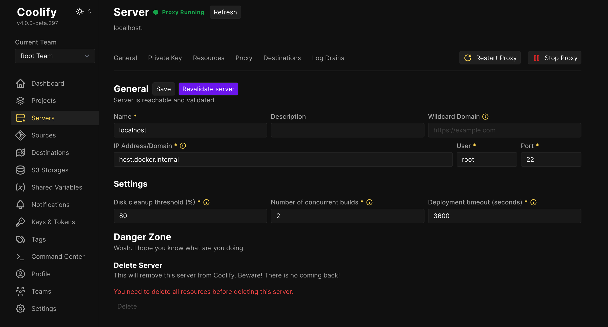

# Coolify

**Coolify** یک پلتفرم متن‌باز برای مدیریت و استقرار اپلیکیشن‌ها است که به کاربران این امکان را می‌دهد تا اپلیکیشن‌های خود را به راحتی بر روی سرورهای خصوصی یا VPS (سرور مجازی خصوصی) مستقر کنند. Coolify بیشتر برای تیم‌ها و توسعه‌دهندگان کوچک و متوسط طراحی شده است و هدف آن ساده‌سازی فرایندهای پیچیده استقرار، مدیریت و مقیاس‌بندی اپلیکیشن‌هاست. این پلتفرم به کمک Docker، Kubernetes و GitOps امکان استقرار اپلیکیشن‌ها را به طور خودکار و با کمترین پیکربندی فراهم می‌آورد. Coolify از قابلیت‌هایی مانند استقرار با یک کلیک، پشتیبانی از چندین اپلیکیشن، و مدیریت خودکار گواهی‌نامه‌های SSL، به‌روزرسانی‌های خودکار، و نظارت بر عملکرد پشتیبانی می‌کند.

**Coolify** همچنین قابلیت اتصال به سرویس‌های مختلف مانند دیتابیس‌ها، ذخیره‌سازی‌ها و سرویس‌های ایمیل را به راحتی از طریق رابط کاربری گرافیکی خود فراهم می‌آورد. به علاوه، این پلتفرم به توسعه‌دهندگان این امکان را می‌دهد که مستقیماً از کد منبع خود اپلیکیشن‌ها را مستقر کنند و به راحتی آن‌ها را مدیریت و مقیاس‌بندی کنند. در نتیجه، Coolify ابزاری مناسب برای کسانی است که نیاز به یک پلتفرم ساده، سریع و قدرتمند برای استقرار و مدیریت اپلیکیشن‌های خود دارند.

## اسکرین شات

در زیر یک تصویر از رابط کاربری Coolify آورده شده است:



### جهت اجرای Coolify با استفاده از Docker Compose، دستور زیر را وارد کنید:

```bash
sudo docker compose up -d
```

