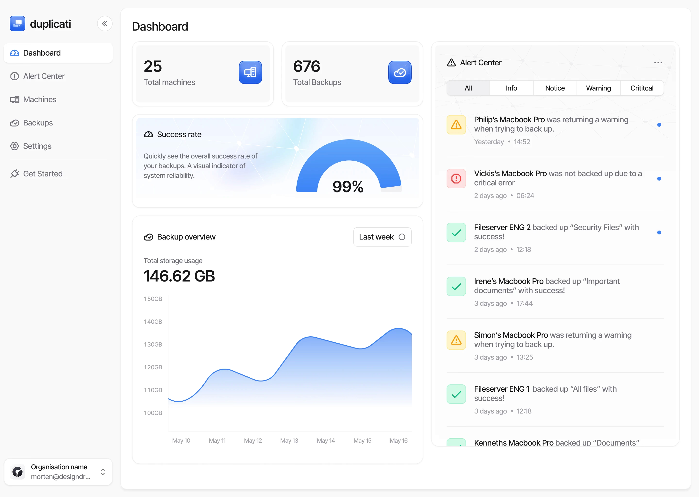

# Duplicati

**Duplicati** یک نرم‌افزار بکاپ و پشتیبان‌گیری رایگان و متن‌باز است که به کاربران این امکان را می‌دهد تا داده‌های خود را به صورت خودکار و به روش‌های مختلف (از جمله رمزگذاری و فشرده‌سازی) به مقصدهای مختلفی همچون فضای ابری، سرورهای FTP، SFTP، WebDAV و بسیاری دیگر پشتیبان‌گیری کنند. Duplicati طراحی شده است تا برای کاربران مبتدی و حرفه‌ای مناسب باشد و دارای رابط کاربری ساده و کاربرپسند است که مدیریت فرآیند پشتیبان‌گیری را تسهیل می‌کند. این ابزار به‌ویژه برای افرادی که نیاز به مدیریت پشتیبان‌های دوره‌ای دارند و به دنبال راه‌حلی امن و مقرون‌به‌صرفه هستند، گزینه‌ای عالی محسوب می‌شود. Duplicati قابلیت فشرده‌سازی و رمزگذاری داده‌ها را نیز دارا است، بنابراین کاربران می‌توانند از ایمنی و کارایی بالای پشتیبان‌های خود اطمینان حاصل کنند.

### ارسال بکاپ به تلگرام

برای ارسال بکاپ به تلگرام، می‌توانید از rclone یا یک اسکریپت Python استفاده کنید:   
```bash
rclone copy /backup telegram:/MyBackups
```

یا با bot API تلگرام:  
```bash 
curl -F "document=@/backup/mybackup.tar.gz" "https://api.telegram.org/bot<TOKEN>/sendDocument?chat_id=<CHAT_ID>"
```

### زمان‌بندی پشتیبان‌گیری با Cronjob

می‌توانید در کرون‌جاب دستور زیر را ثبت کنید تا مثلاً هر روز ساعت ۲ بامداد بکاپ‌گیری انجام شود:
0 2 * * * docker exec duplicati duplicati-cli backup "file:///backup" /source

## اسکرین شات

در زیر یک تصویر از رابط کاربری Duplicati آورده شده است:



### جهت اجرای Duplicati با استفاده از Docker Compose، دستور زیر را وارد کنید:

```bash
sudo docker compose up -d
```

