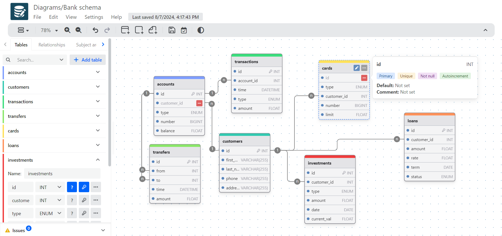

# DrawDB

**DrawDB** یک ابزار آنلاین است که برای طراحی و ترسیم دیاگرام‌ها و مدل‌های پایگاه داده (Database) به‌کار می‌رود. این پلتفرم به کاربران کمک می‌کند تا به‌طور بصری ساختار پایگاه داده‌ها را طراحی کرده و ارتباطات بین جداول مختلف را به‌صورت گرافیکی نمایش دهند. کاربران می‌توانند با کشیدن و رها کردن المان‌ها، جداول و روابط بین آنها را به‌سادگی ایجاد کنند و از طریق رابط کاربری ساده و کاربرپسند، نمودارهای موجود را ویرایش کنند. DrawDB به‌ویژه برای طراحان پایگاه داده، توسعه‌دهندگان و تیم‌های فناوری اطلاعات مفید است، زیرا امکان طراحی مدل‌های ERD (Entity Relationship Diagram) و سایر نمودارهای پایگاه داده را به‌طور سریع و کارآمد فراهم می‌آورد.

## اسکرین شات

در زیر یک تصویر از رابط کاربری DrawDB آورده شده است:



### جهت اجرای DrawDB با استفاده از Docker Compose، دستور زیر را وارد کنید:

```bash
sudo docker compose up -d
```

