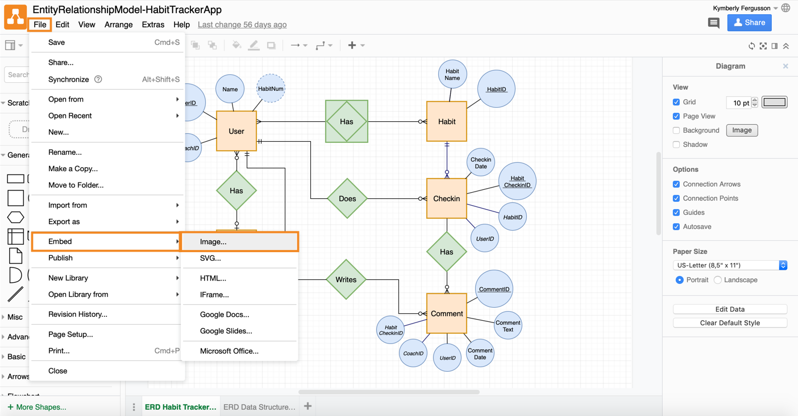

# Draw.io

**Draw.io** (که اکنون به diagrams.net تغییر نام داده است) یک ابزار آنلاین و رایگان برای طراحی و ترسیم نمودارها، دیاگرام‌ها و نمودارهای مختلف است. این پلتفرم به کاربران این امکان را می‌دهد که به‌راحتی نمودارهایی مانند دیاگرام‌های فلوچارت، نقشه‌های ذهنی، دیاگرام‌های سازمانی و معماری سیستم‌ها را ایجاد کنند. با رابط کاربری ساده و کشیدن و رها کردن، کاربران می‌توانند اشکال مختلف را به‌طور سریع و آسان به نمودارها اضافه کنند. همچنین، Draw.io از ذخیره‌سازی ابری پشتیبانی می‌کند و کاربران می‌توانند نمودارهای خود را در پلتفرم‌هایی مانند Google Drive، OneDrive یا حتی به‌صورت فایل‌های محلی ذخیره کنند. این ابزار برای تیم‌ها و پروژه‌های مختلفی که نیاز به ترسیم دیاگرام و مستندسازی دارند، مناسب است.

## اسکرین شات

در زیر یک تصویر از رابط کاربری Draw.io آورده شده است:



### جهت اجرای Draw.io با استفاده از Docker Compose، دستور زیر را وارد کنید:

```bash
sudo docker compose up -d
```

