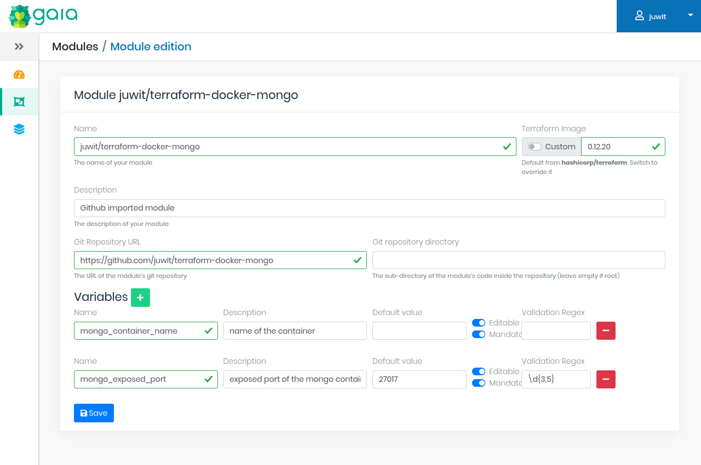

# Gaia

**Gaia** یک پلتفرم مدرن برای مدیریت زیرساخت به عنوان کد (Infrastructure as Code) است که به توسعه‌دهندگان و تیم‌ها کمک می‌کند تا فرآیندهای خود را برای ساخت، تست، و استقرار بهینه‌سازی کنند. این ابزار به‌ویژه برای محیط‌های پیچیده و مقیاس‌پذیر طراحی شده و امکاناتی برای مدیریت بهینه و خودکار منابع مختلف فراهم می‌آورد. Giga توانایی ادغام با ابزارهای مختلف مانند سیستم‌های مانیتورینگ، دیتابیس‌ها و منابع ابری را فراهم می‌کند تا به راحتی زیرساخت‌ها را مدیریت کرده و برنامه‌ها را به سرعت و با اطمینان بالا مستقر کنند.

یکی از ویژگی‌های برجسته Giga، پشتیبانی از Terraform است. این به کاربران این امکان را می‌دهد که به‌راحتی زیرساخت‌های خود را به صورت کد نوشته و مدیریت کنند. از طریق این ویژگی، می‌توان منابع ابری را با استفاده از فایل‌های پیکربندی خودکار کرد و آن‌ها را در هر محیطی که نیاز است، استقرار داد. پشتیبانی از Terraform به توسعه‌دهندگان این امکان را می‌دهد تا به راحتی زیرساخت‌ها را تغییر دهند، مدیریت کنند و مقیاس‌پذیری را در پروژه‌های خود تضمین کنند.

لاگین با نقش ROLE_ADMIN
```bash
username: admin
password: admin123
```

لاگین با نقش ROLE_USER
```bash
username: user
password: user123
```

## اسکرین شات

در زیر یک تصویر از رابط کاربری Gaia آورده شده است:



### جهت اجرای Gaia با استفاده از Docker Compose، دستور زیر را وارد کنید:

```bash
sudo docker compose up -d
```
