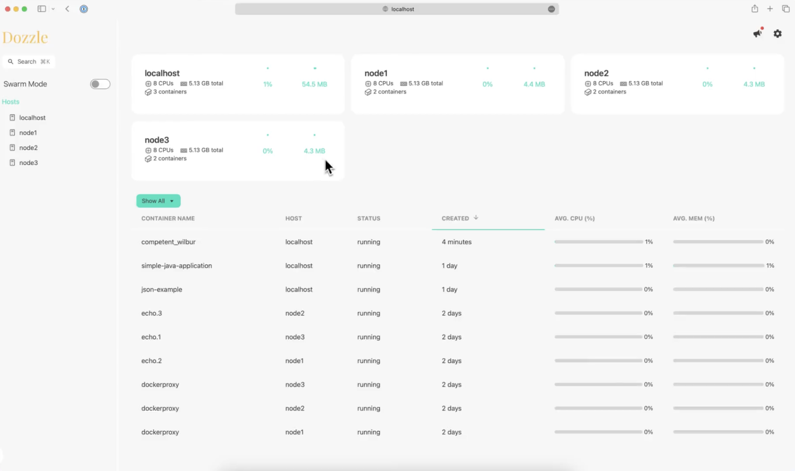

# Dozzle

**Dozzle** یک ابزار ساده و سبک برای مشاهده لاگ‌های Docker به‌صورت real-time است. این ابزار به‌طور خاص برای افرادی طراحی شده است که نیاز دارند تا لاگ‌های کانتینرهای Docker را به راحتی از طریق یک رابط کاربری وب مشاهده کنند. Dozzle به‌طور مستقیم به Docker متصل می‌شود و لاگ‌های کانتینرها را به صورت زنده (live) نمایش می‌دهد. همچنین این ابزار به شما امکان فیلتر کردن لاگ‌ها بر اساس کانتینرها را می‌دهد و همچنین می‌توانید خروجی‌های لاگ را به صورت پیوسته و بدون نیاز به refresh دستی مشاهده کنید. Dozzle یک رابط کاربری ساده و کاربرپسند دارد و برای کسانی که نمی‌خواهند از ابزارهای پیچیده‌تر مانند Grafana یا ELK Stack برای مشاهده لاگ‌ها استفاده کنند، گزینه مناسبی است. Dozzle می‌تواند از طریق Docker Compose یا به‌صورت یک کانتینر مستقل راه‌اندازی شود و با حداقل تنظیمات قابل استفاده است.

## اسکرین شات

در زیر یک تصویر از رابط کاربری Dozzle آورده شده است:



### جهت اجرای Dozzle با استفاده از Docker Compose، دستور زیر را وارد کنید:

```bash
sudo docker compose up -d
```


