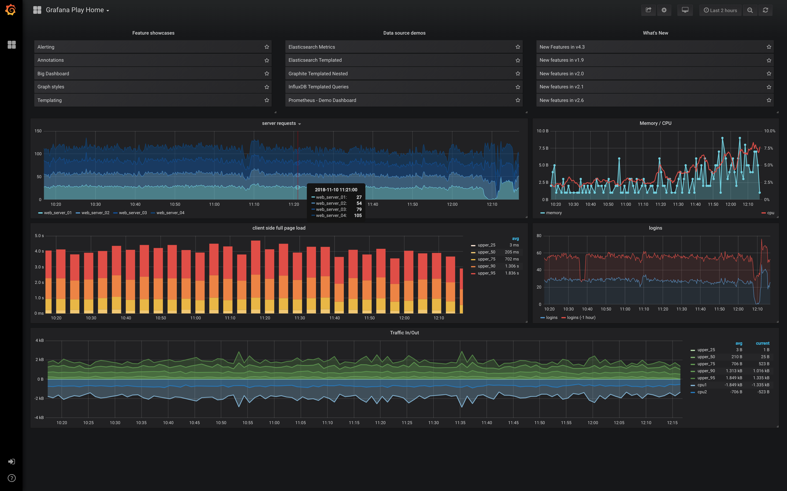

# Grafana

**Grafana** یک پلتفرم منبع باز برای تحلیل و نمایش داده‌های نظارتی است که به کاربران امکان می‌دهد تا داده‌های مختلف از منابع مختلف را جمع‌آوری، تجزیه و تحلیل کرده و در قالب داشبوردهای تعاملی و گرافیکی نمایش دهند. این ابزار به ویژه برای نظارت بر سیستم‌ها، شبکه‌ها، پایگاه داده‌ها، سرورها و دیگر زیرساخت‌های IT کاربرد دارد و به تیم‌های فنی و تحلیلی کمک می‌کند تا عملکرد سیستم‌های خود را به صورت لحظه‌ای پیگیری کنند و مشکلات را سریع‌تر شناسایی کنند.

**Grafana** به کاربران این امکان را می‌دهد که از منابع داده مختلف مانند Prometheus، InfluxDB، Elasticsearch، MySQL، PostgreSQL و بسیاری دیگر برای جمع‌آوری داده‌ها استفاده کنند. این داده‌ها سپس در داشبوردهای قابل تنظیم نمایش داده می‌شوند. یکی از ویژگی‌های برجسته Grafana، قابلیت سفارشی‌سازی بالای داشبوردها است که به کاربران اجازه می‌دهد تا به راحتی نمایش داده‌ها را مطابق با نیاز خود تنظیم کنند. این داشبوردها می‌توانند شامل نمودارها، گراف‌ها، جدول‌ها و دیگر ویجت‌ها باشند که داده‌های مختلف را به شکل بصری و قابل فهم به نمایش می‌گذارند.

**Grafana** از ویژگی‌های پیشرفته‌ای همچون هشداردهی (alerting) نیز برخوردار است. کاربران می‌توانند آلارم‌هایی برای شرایط خاص یا ناهنجاری‌ها تنظیم کنند تا در صورت وقوع مشکلات، به سرعت مطلع شوند. این ویژگی به ویژه برای نظارت بر سیستم‌های پیچیده و پراکنده که نیاز به نظارت دقیق و پیوسته دارند، بسیار مفید است.

## اسکرین شات

در زیر یک تصویر از رابط کاربری Grafana آورده شده است:



### جهت اجرای Grafana با استفاده از Docker Compose، دستور زیر را وارد کنید:

```bash
sudo docker compose up -d
```

