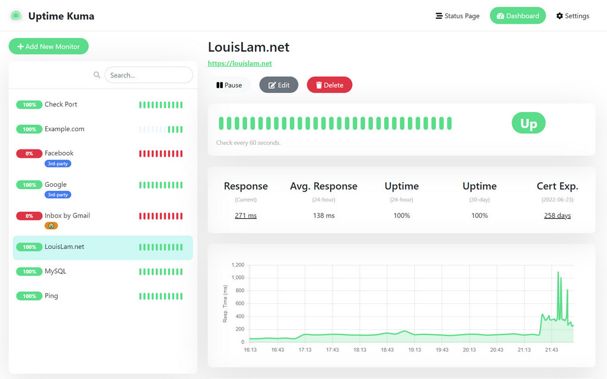

# Uptime Kuma

**Uptime Kuma** یک ابزار متن‌باز و رایگان برای نظارت بر وضعیت سرویس‌ها و وب‌سایت‌ها است که به‌صورت خودکار در زمان‌های مختلف وضعیت دسترسی و عملکرد سرورها را بررسی می‌کند. این ابزار با رابط کاربری وب ساده و کاربرپسند، امکان نظارت بر سرویس‌ها را از طریق روش‌های مختلف نظیر HTTP(S), TCP, ICMP (ping) و حتی WebSocket فراهم می‌کند. Uptime Kuma به‌راحتی نصب و راه‌اندازی می‌شود و می‌تواند به‌صورت محلی یا در سرورهای ابری اجرا شود. از دیگر ویژگی‌های این ابزار می‌توان به اعلان‌ها و هشدارها از طریق ایمیل، Slack، Telegram و سایر روش‌ها اشاره کرد، که به مدیران سیستم اجازه می‌دهد به سرعت از بروز مشکلات مطلع شوند. Uptime Kuma گزینه‌ای ایده‌آل برای نظارت بر سلامت وب‌سایت‌ها و سرویس‌های آنلاین به‌طور مؤثر و آسان است.

## اسکرین شات

در زیر یک تصویر از رابط کاربری Uptime Kuma آورده شده است:



### جهت اجرای Uptime Kuma با استفاده از Docker Compose، دستور زیر را وارد کنید:

```bash
sudo docker compose up -d
```


