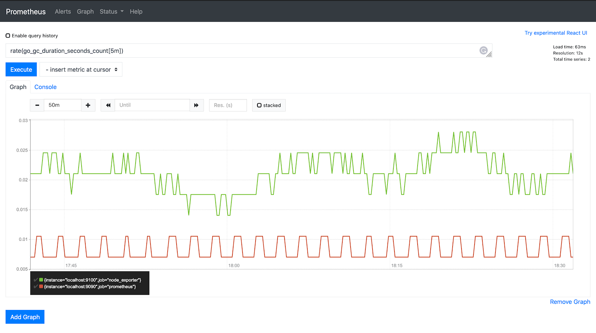

# Prometheus

**Prometheus** یک سیستم منبع باز برای نظارت و جمع‌آوری داده‌های متریک (Metrics) است که به طور ویژه برای کاربردهای مقیاس‌پذیر و پیچیده طراحی شده است. این ابزار به عنوان یک سیستم نظارتی پیشرفته برای زیرساخت‌های نرم‌افزاری، به ویژه در محیط‌های مبتنی بر کانتینر و میکروسرویس‌ها، استفاده می‌شود. Prometheus ابتدا توسط شرکت SoundCloud توسعه داده شد و بعدها به پروژه‌ای مستقل و بخش مهمی از Cloud Native Computing Foundation (CNCF) تبدیل شد.

ویژگی‌های اصلی Prometheus شامل جمع‌آوری داده‌های متریک از سیستم‌ها و سرویس‌ها از طریق Pull-based model است. این مدل به این معنی است که Prometheus به طور دوره‌ای از سرویس‌ها درخواست می‌کند که متریک‌ها را ارسال کنند. Prometheus از یک پایگاه داده زمان‌بندی شده به نام Time Series Database (TSDB) برای ذخیره‌سازی این داده‌ها استفاده می‌کند که به آن امکان می‌دهد مقادیر متریک را در طول زمان ذخیره و تجزیه‌وتحلیل کند.

این ابزار از زبان پرس‌وجوی قدرتمند خود به نام PromQL برای تجزیه و تحلیل داده‌های متریک پشتیبانی می‌کند، که به کاربران این امکان را می‌دهد که داشبوردهای سفارشی برای نظارت بر وضعیت سیستم ایجاد کنند. Prometheus همچنین با ابزارهایی مانند Grafana برای نمایش گرافیکی داده‌ها یکپارچه می‌شود. علاوه بر این، Prometheus از قابلیت‌هایی نظیر هشدار‌دهی (Alerting) برای اطلاع‌رسانی در زمان وقوع شرایط خاص، مقیاس‌پذیری بالا، و یکپارچگی با سایر سیستم‌های نظارتی پشتیبانی می‌کند.

در مجموع، Prometheus به عنوان ابزاری ایده‌آل برای نظارت بر زیرساخت‌ها و سیستم‌های توزیع‌شده، داده‌های حیاتی و عملکردی را برای تحلیل و تصمیم‌گیری‌های آگاهانه در زمان واقعی فراهم می‌آورد.

## اسکرین شات

در زیر یک تصویر از رابط کاربری Prometheus آورده شده است:



### جهت اجرای Prometheus با استفاده از Docker Compose، دستور زیر را وارد کنید:

```bash
sudo docker compose up -d
```


