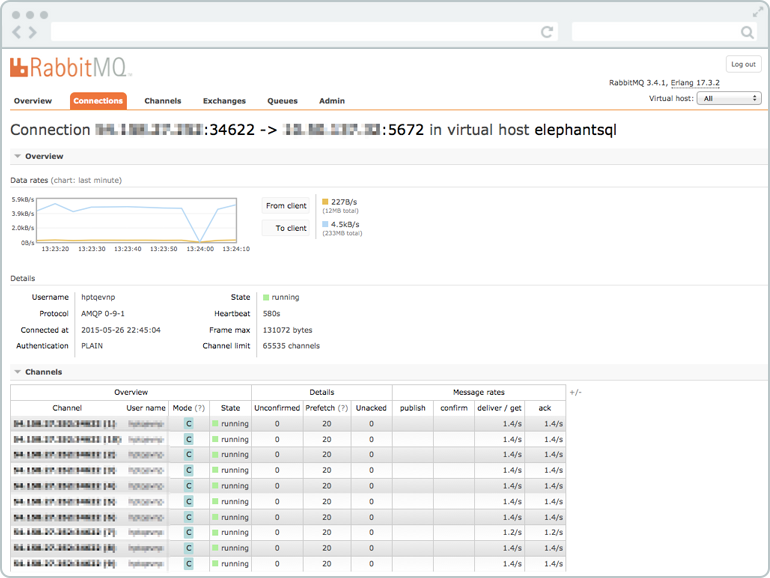

# RabbitMQ

**RabbitMQ** یک سیستم مدیریت صف پیام (Message Broker) متن‌باز است که برای ارسال و دریافت پیام‌ها بین برنامه‌ها و سرویس‌ها به‌طور غیرهمزمان طراحی شده است. این ابزار از پروتکل AMQP (Advanced Message Queuing Protocol) برای ارتباط بین سیستم‌ها استفاده می‌کند و به توسعه‌دهندگان این امکان را می‌دهد تا پیام‌ها را در صف‌های مختلف قرار داده و در زمان مناسب پردازش کنند. RabbitMQ به‌طور گسترده‌ای در معماری‌های میکروسرویس‌ها، پردازش‌های غیرهمزمان، و سیستم‌های توزیع‌شده برای تسهیل ارتباطات میان سرویس‌ها و افزایش مقیاس‌پذیری و قابلیت اطمینان استفاده می‌شود. یکی از ویژگی‌های مهم RabbitMQ، قابلیت پشتیبانی از صف‌های پیام با اولویت، مسیریابی پیشرفته، و تضمین تحویل پیام است که باعث می‌شود در سیستم‌های با ترافیک بالا و پیچیدگی‌های بیشتر نیز به‌خوبی عمل کند.

جهت دسترسی به پنل وب با دستورا زیر فعال نمایید
```bash 
docker exec rabbitmq rabbitmq-plugins enable rabbitmq_management
```
## اسکرین شات

در زیر یک تصویر از رابط کاربری RabbitMQ آورده شده است:



### جهت اجرای RabbitMQ با استفاده از Docker Compose، دستور زیر را وارد کنید:

```bash
sudo docker compose up -d
```

