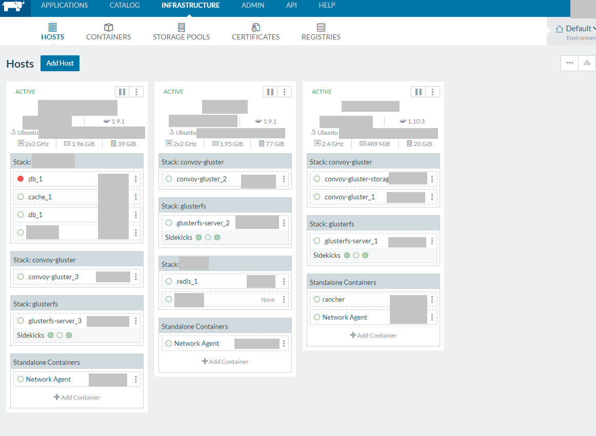

# Rancher

**Rancher** یک پلتفرم مدیریت و اورکستراسیون کانتینر است که به سازمان‌ها کمک می‌کند تا زیرساخت‌های مبتنی بر کانتینر را به راحتی مدیریت کنند. این ابزار به ویژه برای مدیریت کانتینرهای Docker و Kubernetes طراحی شده است و قابلیت‌های گسترده‌ای را برای استقرار، نظارت، مدیریت و مقیاس‌پذیری سرویس‌های مبتنی بر کانتینر فراهم می‌کند.

**Rancher** به عنوان یک رابط کاربری گرافیکی (GUI) و API برای مدیریت کلاسترهای Kubernetes عمل می‌کند و این امکان را فراهم می‌کند که کاربران بدون نیاز به تخصص عمیق در Kubernetes، از امکانات این پلتفرم بهره‌برداری کنند. با Rancher، کاربران می‌توانند کلاسترهای متعدد را از یک داشبورد مرکزی مدیریت کرده و از قابلیت‌هایی همچون مدیریت دسترسی، استقرار خودکار برنامه‌ها، مقیاس‌پذیری خودکار، و مانیتورینگ استفاده کنند. همچنین Rancher از قابلیت‌هایی مانند ایمن‌سازی کانتینرها، پشتیبانی از CI/CD، و ایجاد و مدیریت شبکه‌های کانتینر نیز پشتیبانی می‌کند.

در مجموع، Rancher ابزاری قدرتمند برای سازمان‌هایی است که می‌خواهند زیرساخت‌های مبتنی بر کانتینر خود را مدیریت کنند و به راحتی فرآیندهای پیچیده‌ی اورکستراسیون و استقرار برنامه‌ها را پیاده‌سازی کنند، بدون اینکه نیاز به مدیریت پیچیده‌ی زیرساخت‌های Kubernetes داشته باشند.

## اسکرین شات

در زیر یک تصویر از رابط کاربری Rancher آورده شده است:



### جهت اجرای Rancher با استفاده از Docker Compose، دستور زیر را وارد کنید:

```bash
sudo docker compose up -d
```
