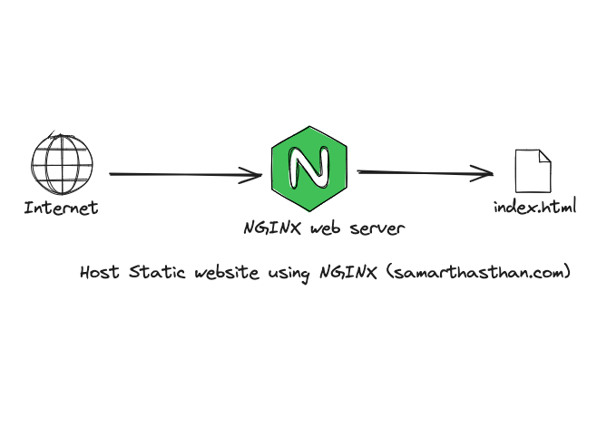

# NGINX

استفاده از **NGINX** برای میزبانی سایت‌های استاتیک یک انتخاب محبوب و کارآمد است. *NGINX* به عنوان یک وب سرور با عملکرد بالا و مصرف منابع پایین، برای سرویس‌دهی سریع به فایل‌های استاتیک مانند HTML، CSS، JavaScript و تصاویر ایده‌آل است. این سرور قادر است تعداد زیادی درخواست همزمان را پردازش کرده و بار زیادی را به راحتی مدیریت کند. به‌طور معمول، در وب‌سایت‌های استاتیک، فایل‌های HTML و رسانه‌ها به‌طور مستقیم از سرور *NGINX* ارسال می‌شوند بدون اینکه پردازش پیچیده‌ای روی سرور انجام شود، که این امر باعث افزایش سرعت و کارایی سایت می‌شود. *NGINX* همچنین امکاناتی مانند فشرده‌سازی محتوا (gzip)، کشینگ (caching)، و تنظیمات برای بهینه‌سازی عملکرد را فراهم می‌کند. این ویژگی‌ها موجب می‌شود که *NGINX* یک انتخاب عالی برای سایت‌های استاتیک باشد که نیاز به بارگذاری سریع و مقیاس‌پذیری بالا دارند.

## اسکرین شات

در زیر یک تصویر از رابط کاربری NGINX آورده شده است:



### جهت اجرای NGINX با استفاده از Docker Compose، دستور زیر را وارد کنید:

```bash
sudo docker compose up -d
```


