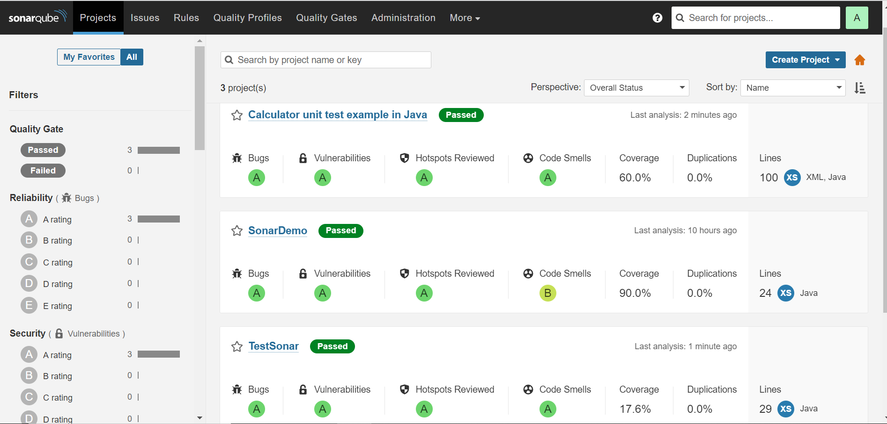

# SonarQube

**SonarQube** یک پلتفرم متن‌باز برای تجزیه و تحلیل کیفیت کد است که به توسعه‌دهندگان کمک می‌کند تا کیفیت کدهای خود را با استفاده از معیارهای مختلفی مانند امنیت، پایداری، عملکرد و قابلیت خوانایی ارزیابی کنند. این ابزار به‌طور خودکار مشکلات کد مانند خطاهای نحوی، مشکلات امنیتی، کد تکراری، و استانداردهای کدنویسی را شناسایی کرده و گزارش‌هایی دقیق از وضعیت کد تولید می‌کند. SonarQube از زبان‌های برنامه‌نویسی مختلفی مانند Java, JavaScript, Python, C++, و بسیاری دیگر پشتیبانی می‌کند و می‌تواند به‌عنوان بخشی از فرآیند CI/CD در ابزارهایی مانند Jenkins یا GitLab CI یکپارچه شود.

## ویژگی‌های کلیدی SonarQube شامل:
- تجزیه و تحلیل کد: شناسایی و گزارش مشکلات کد، از جمله باگ‌ها، آسیب‌پذیری‌ها، و مشکلات مربوط به عملکرد.

- داشبورد گرافیکی: داشبوردهای کاربرپسند برای مشاهده وضعیت کیفیت کد در تیم‌ها و پروژه‌ها.

- پشتیبانی از چندین زبان: پشتیبانی از بیش از 25 زبان برنامه‌نویسی مختلف.

- گزارش‌گیری دقیق: ارائه گزارشات دقیق در مورد مشکلات کد، کد تکراری، پیچیدگی کد، و انحرافات از استانداردهای برنامه‌نویسی.

- یکپارچگی با CI/CD: قابلیت یکپارچگی با سیستم‌های یکپارچه‌سازی مداوم برای بررسی کیفیت کد در هر بار commit و قبل از ادغام آن به پروژه.

- SonarQube به توسعه‌دهندگان و تیم‌ها این امکان را می‌دهد که کدهای خود را بهبود بخشند، مشکلات را سریع‌تر شناسایی کنند و کیفیت کد را در طول زمان افزایش دهند.


### نام کاربری و رمز عبور پیش فرض
```bash
username: admin
password: admin
```

## اسکرین شات

در زیر یک تصویر از رابط کاربری SonarQube آورده شده است:



### جهت اجرای SonarQube با استفاده از Docker Compose، دستور زیر را وارد کنید:

```bash
sudo docker compose up -d
```


