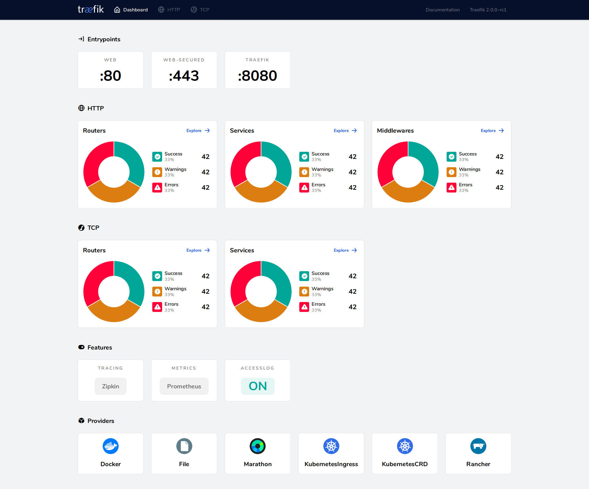

# Traefik

**Traefik** یک پروکسی معکوس (Reverse Proxy) و مدیر بارگذاری (Load Balancer) مدرن و متن‌باز است که به‌ویژه برای میکروسرویس‌ها طراحی شده است. این ابزار به‌طور خودکار با سیستم‌های مدیریت کانتینر مانند Docker، Kubernetes و دیگر سیستم‌ها ادغام می‌شود و تنظیمات مورد نیاز را برای مسیریابی ترافیک به سرویس‌های مختلف به‌طور پویا و بدون نیاز به پیکربندی دستی، انجام می‌دهد. یکی از ویژگی‌های برجسته Traefik، پشتیبانی از TLS (SSL) و مدیریت خودکار گواهی‌نامه‌های SSL از طریق Let’s Encrypt است. همچنین، این ابزار قابلیت نظارت و مانیتورینگ را به‌صورت جامع از طریق داشبورد وب ارائه می‌دهد که به مدیران سیستم کمک می‌کند تا وضعیت ترافیک و سرویس‌های مختلف را به‌راحتی بررسی کنند. با پشتیبانی از قوانین مسیریابی پیچیده و قابلیت‌های پیشرفته، Traefik برای مدیریت ترافیک در معماری‌های میکروسرویس و محیط‌های ابری مناسب است.

## اسکرین شات

در زیر یک تصویر از رابط کاربری Traefik آورده شده است:



### جهت اجرای Traefik با استفاده از Docker Compose، دستور زیر را وارد کنید:

```bash
sudo docker network create traefik_reverse_proxy
```
```bash
sudo docker compose up -d
```


