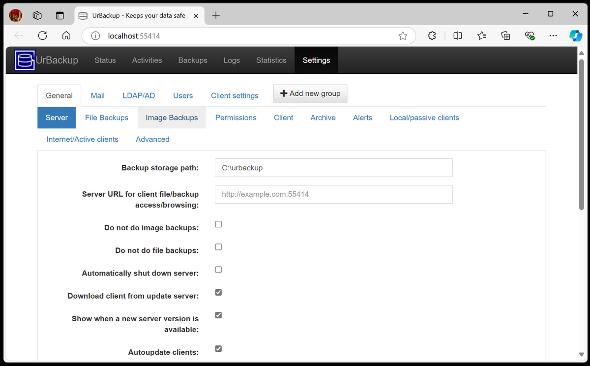

# UrBackup

**UrBackup** یک راهکار پشتیبان‌گیری و بازیابی داده‌های باز است که به‌طور خاص برای ساده‌سازی فرآیند پشتیبان‌گیری از سیستم‌ها طراحی شده است. این نرم‌افزار به صورت خودکار از داده‌های سیستم‌های مختلف، از جمله فایل‌ها و ایمیج‌های سیستم، پشتیبان می‌گیرد و امکان بازیابی آن‌ها را به راحتی فراهم می‌آورد. UrBackup از دو بخش سرور و کلاینت تشکیل شده و به مدیران سیستم این امکان را می‌دهد که با نصب یک سرور مرکزی و کلاینت‌ها روی دستگاه‌های مختلف، پشتیبان‌گیری‌های منظم و خودکار انجام دهند. این نرم‌افزار دارای یک پنل مدیریتی وب است که از طریق آن می‌توان پشتیبان‌گیری‌ها، وضعیت آن‌ها و فرآیندهای بازیابی را به‌طور کامل مدیریت کرد. UrBackup همچنین از قابلیت‌های نظارت بر پهنای باند، رمزنگاری داده‌ها، و مدیریت متمرکز پشتیبان‌گیری‌های متعدد برخوردار است که آن را به ابزاری مناسب برای سازمان‌ها و محیط‌های مختلف تبدیل می‌کند.

## اسکرین شات

در زیر یک تصویر از رابط کاربری UrBackup آورده شده است:



### جهت اجرای UrBackup با استفاده از Docker Compose، دستور زیر را وارد کنید:

```bash
sudo docker compose up -d
```

