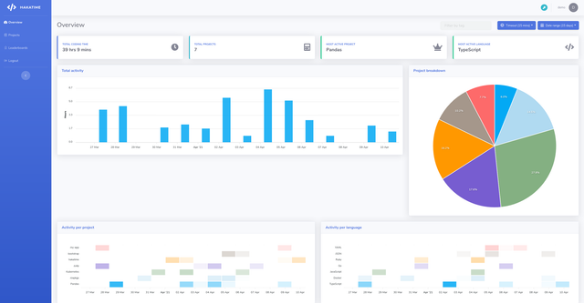

# Hakatime

**Hakatime** یک ابزار زمان‌بندی ساده و کاربرپسند است که به توسعه‌دهندگان کمک می‌کند تا زمان صرف شده در پروژه‌های برنامه‌نویسی خود را به‌طور دقیق پیگیری کنند. این ابزار به‌ویژه برای کسانی که می‌خواهند بهره‌وری خود را افزایش دهند یا درک بهتری از میزان زمان مصرف‌شده در کدنویسی داشته باشند مفید است. Hakatime به‌صورت یک افزونه برای ویرایشگرهای متنی مانند Visual Studio Code یا Sublime Text عمل می‌کند و به‌طور خودکار زمان صرف‌شده در هر پروژه را ثبت کرده و گزارش‌هایی دقیق از فعالیت‌های روزانه، هفتگی یا ماهانه ارائه می‌دهد. این ابزار به توسعه‌دهندگان کمک می‌کند تا بتوانند از زمان خود بهینه‌تر استفاده کنند و بازدهی بهتری در کارهای برنامه‌نویسی خود داشته باشند.

جهت نصب در کلاینت ها به فایل زیر بروید   
`~/.wakatime.cfg`

در قسمت `[settings]` خطوط زیر را اضافه کنید 
  
`api_key=<generated_token>   
api_url=<hakatime_instance_url>/api/v1/users/current/heartbeats.bulk`

## اسکرین شات

در زیر یک تصویر از رابط کاربری Hakatime آورده شده است:



### جهت اجرای Hakatime با استفاده از Docker Compose، دستور زیر را وارد کنید:

```bash
sudo docker compose up -d
```
